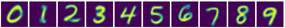
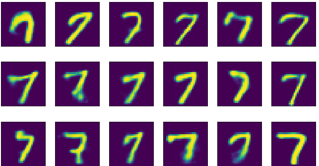

# Autoencoders homework

Autoencoders homework consisted of several tasks devoted to the implementation and some pracitcal uses of autoencoders. Overall, two main approaches were used: fully-connected (__autoencoders_fc_out.ipynb__) and a convolutional one (__autoencoders_conv_out.ipynb__). The latter used a network architecture similar to the [UNET](https://arxiv.org/pdf/1505.04597.pdf) with transpose convolutions in the decoder part.

The tasks were mostly implemented on the ["Labeled Faces in the Wild" (LFW)](http://vis-www.cs.umass.edu/lfw/) images. Dataset download and processing code is located in __get_dataset.py__. For conditional VAE (CVAE) part, the MNIST dataset was used.

All the pretrained models can be found [here](https://drive.google.com/drive/folders/1Q7_QauAFNQJGl8OlM9pt5LAWSqFDr0RD?usp=sharing)

Some of the results of the homework are shown below (for full code and tasks, pls see notebooks):

## Image reconstruction
Basic example of image reconstruction using the convolutional autoencoder looks like this:

  

## Image modification
One of the most obvious uses of autoencoders with the human faces dataset is to add smiles:

## Denoising and occlusion
Other exciting examples of practical use of autoencoders include image denoising and de-occlusion:

### Denoising

  

### Deocclusion

  

## VAE

### Reconstruction
Variational autoencoder implemented here used basically the same architecture as the vanilla one except for the bottleneck part (the one with sampling from Gaussian distributions given mean and variance values). Image reconstruction in this case looks like the following:

  

### Sampling
Considering one is artificially limited to Gaussians in the bottleneck part, sampling from this distribution and feeding the result to the decoder produces the images shown below:  
  

## CVAE
Conditional autoencoder taking into account the image label while training was implemented with the fully-connected architecture on the MNIST dataset. By feeding Gaussian random vectors concatenated with the digit labels one can sample images from the desired class:  
All digits:  
  
Fives:  
  
Sevens:  
  

