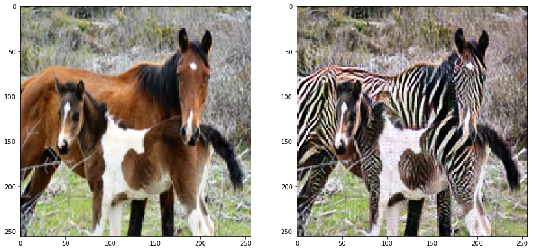
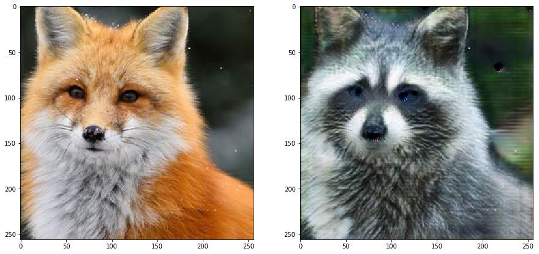

# CycleGAN homework

CycleGAN homework included two parts: implementation of an existing solution on a known dataset and creation of a new dataset with the subsequent CycleGAN code run on it. Horse2zebra dataset was used for the former (see, for example https://www.kaggle.com/suyashdamle/cyclegan), fox2raccoon dataset was created for the latter.

Image scraping was done using the code from __google_images_scrape.py__ (keywords used for the first part of the dataset were 'fox animal photo' and 'лиса', for the second: 'raccoon animal photo' and 'енот'). Further processing (clipping and resizing) was carried out via the methods defined in __image_utils.py__.

## Horse2zebra
Existing solution was mostly done following the logic and code from the original paper (see https://github.com/junyanz/pytorch-CycleGAN-and-pix2pix). Resulting images look like the following:

  

## Fox2raccoon
The second part of the homework was based on a custom fox2raccoon dataset consisting of approximately 3000 images scraped from Google. The CycleGAN used for it was mostly the same as in the first part, except for the Generator architecture, which was varied. Namely, ResUNet (adapted from https://link.springer.com/chapter/10.1007/978-3-030-00889-5_18) and original UNet (https://arxiv.org/pdf/1505.04597.pdf) were implemented. The comparison of the said models is presented below:

### Original architecture:  

### ResUNet:  

### UNet:  

As one can see, the images produced by original UNet are either similar or have higher quality than the ones produced by the original architecture (for more samples, see the "images" folder).
